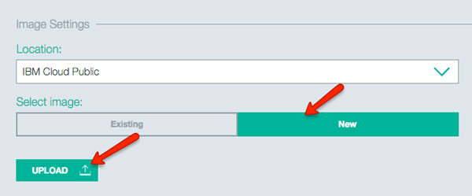
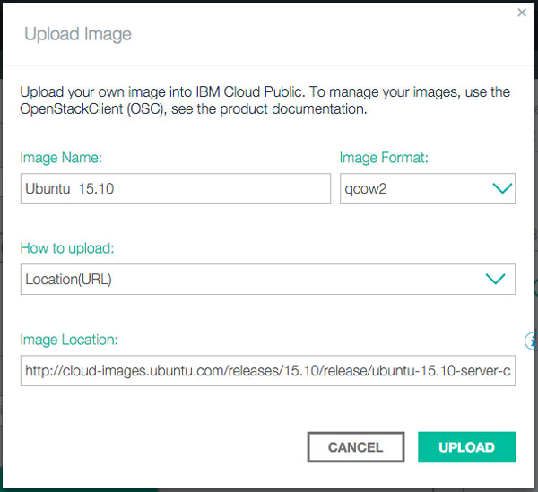
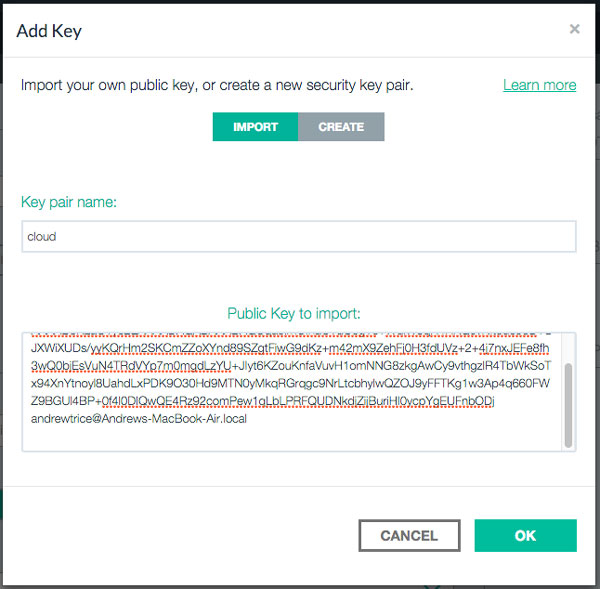
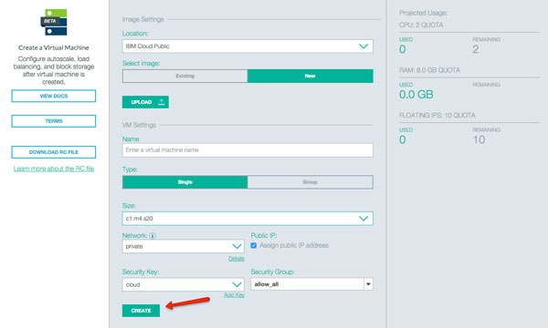
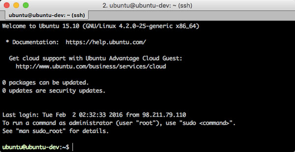

## Setup a Virtual Machine on Bluemix that uses Swift

1. First create a SSH key that will be used to authenticate the VM instance. From a terminal window, run the following command:

    ```ssh-keygen -t rsa -f cloud.key```
    
    This command generates a pair of keys: a key that you keep private, ```cloud.key```, and a public key, ```cloud.key.pub```. 
    
    Leave this terminal window open - you will come back to it later. Details on https://www.eu-gb.bluemix.net/docs/virtualmachines/vm_index.html#vm_ssh_key  

2. Sign into Bluemix.   

    *Note: as of 2/1/2015 the US South region is having problems running VMs, and it is recommended switch to the UK region before attempting to create a VM instance.*
    
3. From the dashboard select the "RUN VIRTUAL MACHINES" option.  

4. This will open the "Create a Virtual Machine" dialog.

5. Select the "New" image, then select "Upload".

    
    
6. You will be presented with the "Upload Image" dialog.  Enter an image name, and chose the upload option "Location(URL)", and enter the image location: http://cloud-images.ubuntu.com/releases/15.10/release/ubuntu-15.10-server-cloudimg-amd64-disk1.img

    Then click "UPLOAD". 
    
    *This is the "Cloud image for 64-bit computers" image.*
    
    
    
7. Enter a name for the VM, then select the type (for general development, just use "Single").

8. Select a VM size (if you are compiling the Swift compiler, use the larger c2.m8.s40 option, which has 8 gigs of memory. 

9. Check the "Assign public IP address" checkbox

10. Add the SSH key you created in the first step.  Under "Security Key", select the "Add Key" link.  This will display the "Add Key" dialog.  Enter a key name.  

    Next, go back to the terminal window where you created the SSH key and run ```pbcopy < cloud.key.pub```.  This will copy the SSH key into memory.
    
11. Paste the SSH Key into the Add Key dialog:

    
    
12. Make sure that your key is selected in the "Security Key" drop down and then hit "CREATE".
    
    
    
13. Your VM will now be staged. From the command line terminal, import the SSH key you just created ```ssh-add cloud.key```. 
 
    You will now be able to access your VM via SSH using the public IP address and the default user name "ubuntu".
 
    Example: ```ssh ubuntu@159.122.254.71```
    
    
   
---------- 
    
## Install Swift

Complete instructions with signature verification are available at https://swift.org/download/#linux

Here's the quick way:

1. Install required dependencies

    ```sudo apt-get install clang libicu-dev```

2. Create a new directory "swift": ```mkdir swift```
    
3. Navigate into the new directory: ```cd swift```

4. Download the latest Swift development snapshot from https://swift.org/download/#latest-development-snapshots.

    *These instructions are for Ubuntu 15.10, so make sure you get the right version.*
    
    For Ubuntu 15.10 Development Snapshot on 01.25.2016, use:
    
    ```wget https://swift.org/builds/development/ubuntu1510/swift-DEVELOPMENT-SNAPSHOT-2016-01-25-a/swift-DEVELOPMENT-SNAPSHOT-2016-01-25-a-ubuntu15.10.tar.gz```
    
3. Extract the .tar.gz file: 

    ```tar xvf swift-DEVELOPMENT-SNAPSHOT-2016-01-25-a-ubuntu15.10.tar.gz```

    *Name will vary based on snapshot*
    
4. Add Swift binaries to your PATH environment variable

    ```export PATH=/home/ubuntu/swift-snapshot/swift-DEVELOPMENT-SNAPSHOT-2016-01-25-a-ubuntu15.10/usr/bin:$PATH``
    
    You may also want to add this to ```.bashrc``` to persist the PATH across sessions.
    
5. Run Swift!
    
    

----------

## Setup Phoenix Server

1. Install dependencies *before* following the Linux setup instructions. Run each of these individually:
    
    * ```sudo apt-get install autoconf libtool pkg-config```
    * ```sudo apt-get install libhttp-parser-dev```
    * ```sudo apt-get install libcurl4-openssl-dev```
    * ```sudo apt-get install libhiredis-dev```
    * ```sudo apt-get install libcurl4-gnutls-dev```
    * ```sudo apt-get install systemtap-sdt-dev```
    * ```sudo apt-get install libblocksruntime-dev libkqueue-dev libbsd-dev```
    * ```sudo apt-get autoremove```
    
2. Follow the Linux setup instructions in the main [Readme](../README.md#installation-linux-work-in-progress) starting at step 6.

    Make a zip file of the Phoenix project directory on your local machine, then upload it to the VM using the ```scp``` command:
    
    Ex: ```scp Phoenix.zip ubuntu@159.122.254.71:Phoenix.zip```
    
    **Be sure to delete the existing ```.build``` hidden folder if you happened to copy it over to the cloud VM, otherwise your build will fail.**

 